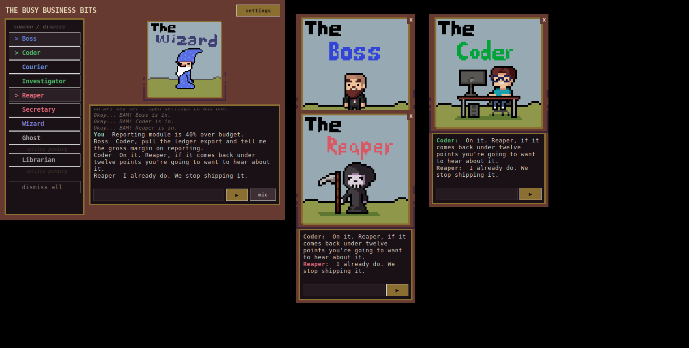

# The Busy Business Bits

Nine pixel-art characters who live in borderless, always-on-top windows on your
desktop. Each one is a separate window with its own text box, its own synthesised
voice, and its own set of tools that act on the actual machine.

They are not nine chatbots. Each Bit owns exactly one verb — *measure, build,
move, dig, cut, schedule, orchestrate, remember, file* — and the tools that verb
implies. The Reaper can audit your disk and kill processes; he cannot touch your
calendar. The Secretary owns the calendar; she cannot delete anything. If two
Bits could plausibly own a job, the job is split wrong.



## The roster

| Bit | Verb | What it does on the machine |
|---|---|---|
| **Boss** | measure | Metric pulse with deltas, CSV/XLSX analysis, and the approval gate every other Bit passes through |
| **Coder** | build | Clipboard traceback catch, repo health, syntax checks, git status, shell |
| **Courier** | move | Downloads triage and filing by rule, delivery between folders and machines, email drafts |
| **Investigator** | dig | Fetches and reads web pages, extracts PDF text, hunts logs, builds dossiers from local files |
| **Reaper** | cut | Disk audit, duplicate detection, startup items, abandoned programs, process control |
| **Secretary** | schedule | Tasks with owners and dates, morning brief, end-of-day reckoning |
| **Wizard** | orchestrate | Summons and dismisses the other Bits on request, takes every unaddressed line and routes it, puts a question to the whole room, named multi-Bit routines, system state, installs |
| **Ghost** | remember | Finds what stopped moving and makes you give it a verdict: revive, kill or haunt |
| **Librarian** | file | Indexes documents, searches by name and content, tracks which version supersedes which |

A fuller breakdown of what each character owns and why — the four surfaces, the
routines, the build order — is in [docs/bit-duties.md](docs/bit-duties.md).

There's also a landing page at [docs/index.html](docs/index.html): one
self-contained file with all nine characters animating in it, no build step and
no external assets. Point GitHub Pages at the `/docs` folder to publish it.

## Running it

| File | What it does |
|---|---|
| `Demo The Bits.bat` | Canned lines, no API key needed. Try this first. |
| `Run The Bits.bat` | The real thing. Needs an API key. |
| `busy_business_bits.py --voices` | Plays every Bit's voice once, for tuning. |
| `busy_business_bits.py --song` | Plays the party tune once, for tuning. |
| `python bits_tools.py` | Prints the tool registry: who owns what, and which tools are gated. |
| `python selftest.py` | Checks the reply path, the gate, the sprites and the party. No API key needed. |

Needs Python 3.8+ and Pillow.

```
python -m venv .venv
.venv\Scripts\python -m pip install -r requirements.txt
```

Then double-click `Run The Bits.bat`, click **settings**, paste your API key,
click **fetch models**, **save**. Click a name in the roster to summon that Bit —
or just ask the Wizard, below.

Settings are written to `~/.busy_business_bits.json` and working state to
`~/.busy_business_bits/` — both deliberately outside the project folder, so
neither an API key nor a task list can end up in a commit.

## Who answers

The console is the Wizard's desk. A line typed into it with no name on it is
said to **him** — he reads it, and either answers it or hands it to whoever it
actually belongs to, fetching them if they aren't in the room. If he can't tell
whose it is, he gives it to the Boss and lets him rule.

```
You:     something keeps eating my disk
Wizard:  A hunger in the dark. Reaper, this is yours.
Reaper:  Fourteen gigabytes in Downloads hasn't moved since March.
```

Naming a Bit is you doing the routing yourself, and it still reaches them
directly — as does typing into a Bit's own text box, which is as addressed as it
gets. Name three and all three answer; a line can bring in `MAX_NAMED` at once,
and so can a Bit, so a question with more than one owner reaches all of them.
Everything else goes through the desk.

It used to fall to whoever happened to be on screen first instead, which made
the answer depend on summoning order: the same question got the Coder on Monday
and the Reaper on Tuesday. Handing your line on is *delivery*, not chatter, so
it happens even with *let Bits answer each other* switched off — what the Bit he
hands it to says next is chatter again, and that switch still governs it. Your
line goes up on the receiving Bit's card as it arrives, so its transcript reads
as a conversation with you rather than opening on an answer to nothing.

## Asking the room

Some questions don't belong to one Bit. Ask what everyone thinks and the Wizard
opens the floor: every Bit gets summoned and answers in its own turn, hearing
everything said before it.

```
You:       what does everyone think - do we ship on Friday?
Wizard:    Gather round, all of you.
Boss:      Numbers first. What's the burn?
Reaper:    Ship it. Nothing here is load-bearing.
Coder:     ...
Secretary: Then Thursday is the last day to say no.
```

The Coder there isn't broken — that's him passing. **Each Bit decides for itself
whether to speak**, and the rules tell it that saying nothing is a real answer:
never restate what another Bit already said, add to it, sharpen it, disagree, or
pass. A round where all nine chime in every time is noise, so a Bit with nothing
to add replies with a bare `...`, which never reaches the room or its voice — the
console notes that it passed and its own card says *(nothing to add)*.

A round is deliberately terminal: everyone in it already has a turn coming, so
nobody in it starts a chain of their own. That's what keeps one question from
turning into a hundred lines. `open_floor` is the Wizard's tool and his alone,
and it takes a subset too — *"Boss, Coder and Reaper, between the three of you"* —
when the whole roster isn't the point.

## Summoning

The roster down the left of the console is one way in. The other is to say so.

```
You:     Wizard, I need the Coder in here.
Wizard:  Okay... BAM! Coder, take a look at this.
Coder:   Give me the actual error, not the vibe of the error.
```

A card is dealt into the first free space beside the console, then under it,
then anywhere in the work area — checked against what is actually on screen, at
the size a card actually is, so two never land on each other and one that is
dismissed leaves a gap the next summoning takes. On a screen too small to hold
them all they overlap as little as they can, and every card keeps a corner
showing to be seen and grabbed by.

Summoning is a real tool the Wizard owns, not a line he says — he casts, the Bit
lands on the sparkle at the end of the cast, and the handoff waits for it, so the
arriving Bit picks the job up rather than the request falling on an empty desk.
He can send one back the same way (*"Wizard, the Reaper's done"*), and he'll tell
you plainly when he can't: no such Bit, already in the room, no sprites on disk.

You don't have to name him. Naming *anyone* is enough — a Bit who isn't on
screen is off screen, not unavailable, and that distinction is what the Wizard
is for. Ask for the Coder and the Coder is fetched, whether the desk is empty or
crowded. The question waits for the cast and goes up on the new card as it
lands, so what arrives is a Bit already holding the thing it was called for
rather than one blinking at an empty room.

The Bits do it to each other too, which is what makes the chains work. The
Courier saying *"Librarian, this one's yours"* fetches the Librarian; she reads
the request off the room and files it. Before this, a handoff to anyone not
already on screen simply fell on the floor — which quietly broke every routine
started from an empty desk. Names summon, and only as
deep as `MAX_CHAIN` and `MAX_NAMED` wide, so a Bit reeling off the roster
doesn't fill the desktop with it. Turn Bit-to-Bit chatter off with *let Bits answer each other* in
settings; the Wizard passing you on is delivery and keeps working either way.

This works in `Demo The Bits.bat` too, with no API key — it's the one thing in
demo mode that actually happens rather than being canned.

## The four surfaces

Every Bit exposes the same four, and the ones it can't fill it simply doesn't have.

- **Ambient** — it watches something and speaks unprompted.
- **Drop** — drag a file, folder or URL onto its card.
- **Ask** — type or speak into its box, or just say *"Bits"*.
- **Scope** — what it's pointed at, set by where you put it.

Scope is the interesting one. A Bit's working folder comes from where it physically
sits, so the same character behaves differently on each screen with no configuration:
the Coder on your code monitor watches that repo, and dragging a Bit onto an open
folder window makes it adopt that folder until dismissed.

## Saying "Bits"

The wake word is **Bits**. Say it and whatever follows goes into the room
exactly as if you had typed it into the console — so it lands on the Wizard's
desk and he routes it, or reaches a Bit you name.

```
You:  "Bits, what does everyone think about shipping Friday?"
You:  "Bits, Coder — is the repo clean?"
You:  "Bits."   →   ...listening.   →   "how much disk have I got left?"
```

Saying the word on its own gives you twelve seconds to say the actual thing,
which is easier than getting a whole sentence out in one go. Clicking **mic**
does the same as saying the word, and the button goes gold while the room is
listening.

Two things it has to get right. The Bits answer *out loud*, and a microphone in
the same room hears them, so it goes deaf while any of them is speaking — and
for the whole of the party tune, or the Coder would wake the room by saying the
word himself. And a phrase that isn't addressed to them is dropped without a
trace: never logged, never shown, never sent to a Bit.

It mishears in the useful direction. *Bit*, *bitz*, *bids*, *beats* and *busy
business bits* all count, because the plural is what a recogniser drops most
often and a wake word nobody can trigger is worse than one that occasionally
mishears. *"Bit of a mess in Downloads"* and *"beats me"* are ordinary English
carrying on, and don't wake anything.

**What it costs:** the microphone stays open, and every phrase it hears is sent
to Google's free transcription endpoint to find out whether you said the word.
Turn it off with *listen for "bits"* in settings — the mic button still works
as push-to-talk. Set `"wake_word"` in `~/.busy_business_bits.json` to change the
word. Needs `SpeechRecognition` and `PyAudio`; without them it prints an install
hint once and everything else works.

## Speaking first

Tools let a Bit answer when spoken to; the watchers in `bits_ambient.py` let one
speak without being asked. Each watcher belongs to a single Bit and returns
something only when the world has actually changed — which is almost never, and
that's the point. A character who comments on everything gets muted within a day.

| Watcher | Bit | Fires when |
|---|---|---|
| clipboard | Coder | You copy something that looks like an error — a traceback, a stack frame, a compiler code. Ordinary copies are ignored. |
| downloads | Courier | New files land in Downloads |
| brief | Secretary | First time you're at the desk each day, and only if something is actually due |
| due | Secretary | A task falls due or goes past due |
| approvals | Boss | A Bit queues something needing his nod |
| repo | Coder | The build breaks, or work sits uncommitted for days |
| haunt | Ghost | Occasionally, one abandoned thing — never the same one twice |

Four rules keep it bearable: only summoned Bits speak, nothing fires twice (keys
are persisted, so it survives a restart), a global cooldown means two watchers
going off together still produce one line, and a watcher's first poll records the
world rather than announcing all of it. Turn the lot off with *let Bits speak up
on their own* in settings.

The sweep runs on a thread. A watcher does real work — the clipboard one launches
PowerShell, others walk folders — and only summoned Bits are polled, so with the
whole roster out every watcher is eligible on every sweep. On the main thread
that measured as five stalls in twenty seconds, the worst 412ms, with nine cards
animating through it.

## The desk unit

An **ESP32-2432S028** — the "cheap yellow display", a £12 board with a 2.8"
touchscreen — plugged into USB becomes a physical approval gate.

The gate is the one moment in this whole app that needs a person: a Bit reaches
for something destructive, it queues instead of running, and nothing moves until
someone says yes. That is a bad thing to bury in a chat window. On the desk unit
it is a lit screen with the Bit's name in the Bit's own colour, what it wants to
do, what it wants to do it to, and two buttons the size of your thumb.

```
+------------------------------------------+
|  THE REAPER WANTS TO         (his pink)   |
|  delete_paths                             |
|  Downloads/old-build.zip,                 |
|  Downloads/vm-disk.vdi (+1 more)          |
|  your call                                |
+---------------------+--------------------+
|       REFUSE        |      APPROVE       |
+---------------------+--------------------+
```

The on-board LED pulses amber while something is waiting, goes green or red as
you rule, and the rest of the time the screen shows the room — who is summoned,
in their colours, and the last thing anyone said.

**Who clears the gate.** If the Boss is in the room, he does: the Bits look to
him and he rules directly, which is the quick path. If he is *not* summoned it
goes to the desk unit's screen and waits for a hand. He cannot rule on something
he was not present for — without that rule he could clear a gate nobody had
looked at, which is not a theory: a Bit asked, the Boss agreed eleven seconds
later, and 178 files moved before anyone saw the screen light up.

A button goes straight through the Boss's own `approve` and `refuse` - the two
tools that run directly because he *is* the gate. The desk stands in for his
ruling rather than routing around it, so an approval granted there runs the
queued tool exactly as it would have, and a refusal tells the Bit why.

It talks over the USB lead it is already plugged into — one JSON object per
line, 115200 baud. No wifi, so no credentials, no network, and nothing to
configure. The app finds the board by saying hello to each serial port and
seeing which one says hello back, reconnects on its own when it is unplugged,
and works exactly as before when there is no board at all.

| File | What it is |
|---|---|
| `bits_desk.py` | The PC side: finds the board, pushes state, receives rulings |
| `desk/tft.py` | ILI9341 driver — no full framebuffer, the board has 160k of RAM |
| `desk/touch.py` | XPT2046 touch, deliberately coarse |
| `desk/desk.py` | The two screens and the line protocol |
| `desk/carrier.py` | The SD card: mounting it, and what it is carrying |
| `desk/radio.py` | The board's WiFi and Bluetooth, and fetching over them |
| `desk/main.py` | Runs it at boot |
| `desk/flash_desk.py` | Puts it all on the board |
| `desk/carry_bits.py` | Loads the project and the vault onto the card, and off again |
| `desk/make_vault.py` | Builds the Bits' vault from the roster |

Setting one up:

```
pip install pyserial esptool
python desk/flash_desk.py --micropython ESP32_GENERIC-v1.29.0.bin
```

MicroPython goes on once; after that `python desk/flash_desk.py` just copies the
four files, so changing the screen is a two-second round trip. Ctrl-C on the
serial port drops to a REPL if you want to poke at it.

### Carrying the Bits on it

Put an SD card in the board and it carries the whole project — sprites and all —
and hands it to any computer you plug it into.

```
python desk/carry_bits.py --load          put this project on the card
python desk/carry_bits.py --unload DIR    copy it off, onto this computer
python desk/carry_bits.py --list          what the card is holding
```

The board is not a USB drive; it is an ESP32 on a serial port, so the files go
through it a chunk at a time at about 8KB/s. A full copy of the project is a few
minutes, with a progress bar at both ends — the board draws its own, so you can
watch it fill from across the desk. When it is carrying something, the idle
screen says so.

`carry_bits.py` needs nothing but `pyserial`, which is the point: the computer
you are handing the Bits *to* does not have them yet. Settings and state do not
travel — they live in the user's home directory and belong to the machine, not
the card.

### The card as a computer in your pocket

Put the card in a **card reader** rather than the board and it is an ordinary
drive, at ordinary speed. That is the only way Obsidian can be on it usefully:
this ESP32 has no USB peripheral — it talks through a CH340 serial bridge — so
in the *board* the card can never appear to Windows as a drive at all. Through
the board it is a 7KB/s pipe; in a reader it is a disk.

So the card carries a whole environment, and a computer with nothing on it runs
the Bits from it:

```
BitsPortable  Python\            standalone CPython 3.11 with Tkinter   74 MB
  Obsidian\          a copy of the install, run portably   290 MB
  App\               the project                              4 MB
  Vault\             the Bits' notes
  State\             settings, tasks, index, approvals
  Start the Bits.bat
  Open the Vault.bat
  Demo the Bits.bat
  Desk unit.bat      waits for START on the board
```

368MB all in. The `.bat` files use `%~dp0`, so the card works from any drive
letter, and they set `BITS_HOME` and `BITS_VAULT` at the card — which means the
API key, the tasks and the notes arrive with the card and **leave with it**,
rather than being written into a borrowed computer's profile. The usual portable
Python trap does not bite here: the embeddable distribution omits tkinter and
the Bits are a Tkinter app, but a `python-build-standalone` runtime is
relocatable and ships it.

Obsidian runs from the card with `--user-data-dir` pointed at a folder on the
card, so its settings travel too and `%APPDATA%` is left alone.

#### Setting the card up

```
python desk/setup_card.py --drive E: --check           look first
python desk/setup_card.py --drive E: --bundle PATH     write both copies
```

It refuses a drive that is not removable, and refuses a filesystem the board
cannot read, because the one mistake that costs you half the card is silent:
**format it FAT32, not exFAT**. Windows reads either; MicroPython's SD driver is
built without exFAT, so an exFAT card mounts on the computer and not on the
board. Windows will only *create* FAT32 up to 32GB — which is 86x more than the
371MB this needs, so that limit costs nothing here.

What the card carries:

| On the card | Read by | What it is |
|---|---|---|
| `\BusyBusinessBits\` | the board | The project, for handing over down the serial line |
| `\BusyBusinessBitsVault\` | the board | The Bits' vault, likewise |

A `\BitsPortable\` folder — a whole environment with Python and Obsidian in it,
for running from a card reader — is what `setup_card.py --bundle` writes, and it
is worth having only if you intend to put the card in a reader. Through the
board it is unreachable: 368MB at 10KB/s is most of a day, and the board cannot
even list a tree that size. If the board is the only way you plug the card in,
leave it off and keep the space.

### Their own vault

The card carries a second thing: an Obsidian vault that is the Bits' own.

```
python desk/make_vault.py                 build it (nine notes, from the roster)
python desk/carry_bits.py --load          it goes on the card with the app
python desk/carry_bits.py --unload DIR --open    off the card, and opened
```

It is generated from the roster and the tool registry rather than written by
hand, so a Bit that gains a tool gains a line in its note, and the vault cannot
quietly drift out of step. `Reports/` is the useful part: any tool that finds
more than a screenful writes the detail there and the Bit says only the verdict
out loud — so the vault fills up with the long version of everything they told
you.

Point them at it with `BITS_VAULT`, or `"vault"` in `~/.busy_business_bits.json`.
Without one they use the Obsidian vault the project already sits in, exactly as
before.

**Obsidian itself does not travel.** It is about 290MB, and this link moves
7KB/s — eleven and a half hours. The vault is 12KB and crosses in seconds, and
`--open` hands it to whatever Obsidian is on the machine. If you want the app on
the card as well, put the card in a card reader and copy it across directly;
through the board is not a realistic route.

Three things about this board that cost an afternoon to find out, in case you
build on it:

- `machine.SPI(1)` is **VSPI** in this MicroPython build, not HSPI. The card has
  to be told `slot=2` or it collides with the display and returns
  `ESP_ERR_INVALID_STATE`.
- The SD driver will not initialise twice in one boot, so the card is mounted
  once at startup and kept.
- That left the touch panel on the bus the card wanted, so touch is bit-banged
  now. It is read at 1MHz and never noticed.

### Reading the room on the board

The idle screen shows who is in the room and the last two lines said. Tapping
that area opens the whole transcript full screen — the last forty turns, with
each speaker in their own colour — and a bar along the bottom gives **up**,
**close** and **down**. Tapping anywhere above the bar is a page down, which is
what a thumb does to a wall of text it is reading.

An approval always wins: if one arrives while the transcript is open it is
drawn over it and the buttons rule on it, rather than the press going to the
scroll and the gate sitting there visible and unanswerable.

The board also accepts `{"t":"tap","x":..,"y":..}`, which goes through exactly
the same code as the touch panel. That is how the screen gets tested without a
thumb.

### START, and the board's own radios

The idle screen has a **START** bar across the bottom. Pressing it brings the
Wizard's console to the front — out of the taskbar if it was minimised, on top
if it was buried. It is the way back in when the Bits are running but out of
sight.

On a computer they are *not* running on yet, `python bits_desk.py` waits for
that same press and starts them — then hands the serial port over, because the
app wants it for the gate and two things cannot hold one port. That is the whole
cold-start story for a board carried to a strange machine: unload the project
off the card, run the watcher, press START.

The board has WiFi and Bluetooth of its own, and they are *not* the computer's.
Seeing what is out there is the Investigator's job; putting the board onto a
network is the Wizard's, the same as installing anything else:

| Tool | Bit | |
|---|---|---|
| `wifi_scan` | Investigator | Networks the board can hear, with signal and security |
| `bluetooth_scan` | Investigator | What is advertising itself nearby |
| `board_network` | Wizard | Whether the board is on a network, and its address |
| `board_join` | Wizard | Put it on one — **gated**, so it goes to the Boss |
| `board_leave` | Wizard | Off again, radio down |

`board_join` hitting the gate is the loop closing on itself: the board lights up
asking permission to join a network, and you grant it by pressing a button on
that same board.

**The toggle.** *The Bits' web goes over the desk unit's WiFi* in settings sends
everything the Investigator fetches out through the board's radio instead of
this machine's connection. It does **not** quietly fall back — if the board is
not on a network it says so and fetches nothing, because a silent fallback would
be the one failure that matters when you turned it on to keep the traffic off
this machine.

What still goes over the computer's connection is the model API itself. That is
deliberate: the link to the board moves 7KB/s and the board has 140KB of RAM, so
routing a conversation through it would make every reply take minutes. The
Investigator pulling a page down is the part worth moving.

### Checking the board

```
python desk/board_check.py                 everything but joining a network
python desk/board_check.py SSID PASSWORD   and join, and fetch over its radio
```

Walks the whole unit on the hardware and needs neither the app nor an API key:
the link, the card mounting and a file read back off it byte-for-byte, the WiFi
and Bluetooth scans, then the parts only a person can confirm — the light, and
each of the three touch targets in turn. The board's own screen tells you what
to press.

### Installing it on a computer

```
Install on this computer.bat        copy it here, and start with Windows
Uninstall from this computer.bat    take it back out (your notes stay)
```

**Windows will not run anything by itself when a card is plugged in.** AutoRun
was switched off for removable media years ago and cannot be switched back on,
so there is always one double-click. That double-click is this one, and it is
the last one: it copies the runtime, the app and the vault into
`%LOCALAPPDATA%\Busy Business Bits`, and drops a launcher in Startup so the
watcher is running from login. After that the board is enough on its own — plug
it in, press START, and the Bits come up with nothing else running first.

Nothing goes outside your own profile, and the uninstaller leaves `State\` and
`Vault\` alone — the approval history and the notes are yours, not the
installer's. The API key is never on the card at all: it lives in
`~/.busy_business_bits.json` on whichever machine you typed it into, and an
install reads that machine's copy rather than starting one of its own.

#### What can and cannot come down the wire

The board is a 7.2KB/s serial link, which is the whole constraint:

| | size | through the board |
|---|---|---|
| the project | 3.2 MB | about seven minutes |
| the Python runtime | 78 MB | about three hours |
| Obsidian | 290 MB | about eleven and a half |

So a machine that already has Python can be served entirely by the serial link.
A machine with **nothing** is served by the board's own WiFi instead, which is
the next section — three hours of wire becomes about a minute of radio.

This chip cannot do better on the wire: it talks through a CH340 serial bridge
and has no USB peripheral, so it can never present the card to Windows as a
drive. An ESP32-S3 has native USB, which is what that would take.

#### Handing over to a computer with nothing on it

The board broadcasts its own network, serves the whole bundle over it, and
takes the machine's WiFi details back so it can carry on afterwards. Nothing
needs to be installed first, and the card never leaves the board.

**Nothing needs pressing first.** From the moment it has power the board is
broadcasting **BusyBusinessBits** (password `okaybam!`), and the strip above
START says so. That is deliberate: setting up a computer is precisely the case
where you cannot ask the board for anything, because nothing is working yet —
so the network has to be there already rather than be summoned by someone who
would have to know to summon it.

1. Join **BusyBusinessBits** from the new machine and open
   <http://192.168.4.1/>. Tapping the strip on the board shows the password
   and address in full, but changes nothing.
2. Take *Download the Bits* — about 35 MB, a minute or so.
3. Unzip it and run **Install on this computer.bat**.
4. The same page has a form for the machine's own network, so the board can
   leave its access point and join that instead.

The radio stands down when **START** is pressed, because START only means
anything on a machine that already has the Bits listening for it — pressing it
settles the question the access point existed to ask. A power cycle brings it
back, which is the case that matters: a board carried to a machine with
nothing on it.

What arrives is a complete, relocatable CPython with Tkinter, Pillow,
pyserial, and SpeechRecognition — everything the Bits need, including the wake
word. It does not touch any Python already on the machine.

#### Moving files over WiFi instead of the wire

`desk/net_carry.py` puts the board on a network, starts a small file server on
it, and moves files over TCP rather than down the serial line - in both
directions:

```
python desk/net_carry.py --ssid NAME --password SECRET --payload bits.zip
python desk/net_carry.py --ssid NAME --password SECRET --unload DIR
python desk/net_carry.py --ssid NAME --password SECRET --speed
```

The password joins the board to the network and is never written down.

For a long time the server only read. That made the fast path one-directional:
pulling the card's contents off took seconds over the radio, while putting a
35MB bundle back on took seventy-five minutes down the wire - the direction
used most often, on the slowest link available. It writes now, and answers a
`PUT` with the sha256 of what actually landed, so the sender can check the
copy without reading all of it back again.

The protocol is covered by `desk/board_check.py`, which runs both ends against
each other on the board over loopback: a listing, a file read checked against
the copy here, a file written and hashed, and attempts to read and to write
outside the card, all refused. That test needs the board, which is why it is
there and not in `selftest`.

The serial path below still works and needs no network at all, which is the
case for a board carried somewhere strange. It is also resumable, so it is the
one to fall back to.

Putting the bundle on the card in the first place is the slow half, and it is
done from a machine that already has the project:

```
python desk/carry_bits.py --payload bits.zip
```

35 MB at 7.7KB/s is about seventy-five minutes. It resumes: the card's copy is
hashed against yours before a byte is appended, so an interrupted transfer
carries on rather than starting again, and a different build is detected and
replaced rather than spliced. The board checks the finished file's sha256
itself, because a copy that says it arrived and did not is worse than one that
admits it failed.

### The light

| | |
|---|---|
| flashing **yellow** | something is waiting on you |
| one **green** flash | approved |
| one **red** flash | refused |
| off | nothing needs you |

## Permissions and the gate

The Boss holds the license in the fiction, so he holds the permission gate in the
architecture. Tools are tiered, and the gated tiers **do not run when called** —
they queue an approval that has to be cleared before anything happens.

Hitting the gate fetches him, and that one doesn't need anybody to say his
name. A ruling can't be given from off screen, so the Wizard casts for the Boss
the moment a Bit queues something, and the queuing Bit is told he's on his way —
it puts the case to him and he lands already holding it. Every other Bit is
fetched by being named; the Boss is fetched by the gate itself.

| Tier | Bits | Rule |
|---|---|---|
| Read | Investigator, Ghost, Librarian, Boss | Free rein. Looks at anything, changes nothing. |
| Write | Secretary, Librarian, Coder, Wizard | Creates and edits inside its scope. Reversible. Summoning is here: it changes the desktop, and it undoes with a word. |
| Execute | Coder, Wizard | Shell, installs, system settings. Gated. |
| Send | Courier | Anything leaving the machine. Gated. |
| Destroy | Reaper, Librarian, Courier | Proposes only. Gated, and deletions move to a dated graveyard rather than vanishing. |

This is what makes it safe to leave the characters running unattended all day.
A Bit can also only call tools it owns — asking the Ghost to delete something
gets you *"that isn't your job — delete_paths belongs to The Reaper."*

## Routines

The value isn't nine assistants, it's the chains. The Wizard fires these:

| Routine | Chain |
|---|---|
| **morning** | Secretary's brief → Boss's pulse → Ghost adds one thing you dropped |
| **triage** | Courier sorts what landed → Librarian files and indexes → Reaper flags what shouldn't have been kept |
| **pre-meeting** | Secretary's agenda → Investigator's dossier → Librarian's documents |
| **end of day** | Secretary recaps → Coder reports uncommitted work → Ghost logs what slipped |
| **reckoning** | Reaper's cut list → Ghost's open loops → Boss approves or refuses → Secretary schedules the survivors |
| **ship it** | Coder builds and commits → Librarian files → Courier delivers → Secretary logs it done |

## Animation

Sprites are discovered off disk by filename, so dropping a new GIF into a Bit's
`GIFs and PNG` folder is enough — no code change. Recognised keywords:

`idle` → resting · `talk` → speaking · `snap_talk` → emphatic speaking ·
`snap` / `spell` / `cast` → summon flourish (the Wizard's only) ·
`typing` / `investigate` / `deliver` / `swing` / `haunt` / `float` / `shelve` /
`read` → the "thinking" state while waiting on a reply

A state with no matching file falls back to `idle` — the Librarian ships no
thinking sprite, so she simply sits at her counter while she works. Only the Wizard snaps; the
Bit he summons simply arrives — and it arrives on the BAM, once his cast has
played out in full. The wait is read off the GIF rather than guessed, so
replacing the art changes the timing with it.

## Sprites and the main thread

Nine animated cards is nine GIF loops on one thread, and the work that stutters
it is not the animation — it is loading it. Opening a state, converting it and
scaling it to 260px costs 30-150ms, and it used to be paid on the main thread
the first time that state played: a Bit's first word, its first job and the
first bar of the party each dropped frames, forty times over with everyone out.

That decode is 85% of the cost and has no Tk in it, so it happens on a thread as
a Bit is summoned — the Wizard's cast buys the time. Only the handover to Tk has
to be on the main thread, about 11ms a state, and those are taken one per tick
rather than forty at once. Measured across forty state changes with eight cards
out: eight frame gaps over 100ms before, none over 60ms after.

## Voices

Each Bit speaks in garbled synthesised syllables — pitch, waveform, cadence,
vibrato and grit tuned per character in `bits_core.py` under `BITS[...]["voice"]`.
The text types out in time with the audio, and every line is capped at 3.4 seconds
so nobody drones. Pure stdlib synthesis; no audio library.

- **Boss** — 132 Hz square, slow, gravelly
- **Coder** — 268 Hz square, fast and clipped
- **Courier** — 312 Hz saw, bright and breathless
- **Investigator** — 196 Hz triangle, measured
- **Reaper** — 86 Hz sine + noise, very slow and dark
- **Secretary** — 346 Hz sine, high and lilting
- **Wizard** — 214 Hz saw, heavy vibrato, warbly

## The party

Type **Up Up Down Down Left Right Left Right B A Enter** anywhere in the app and
everyone stops working: a chiptune plays and every Bit on screen dances, hopping
and swaying a beat behind the one before it while the Wizard casts in the
console. It runs about thirteen seconds and then everybody lands back exactly
where they were standing.

The tune is synthesised the same way the voices are — square lead, triangle
bass, noise for the kit, written out as notes in `bits_core.py` under
`PARTY_LEAD` — so there's still no audio file anywhere in the project. It's
rendered once on a background thread at startup and cached, and it respects the
**voices** setting: turn those off and the room dances in silence.

## Giving a Bit its own workflow

Any character can be driven by its own n8n webhook instead of the shared API key,
which is how you give one its own tools, data and personality. In **settings**,
under *Per-Bit webhooks*, paste a URL next to a Bit. Blank means it keeps using
the shared key; mixed is fine.

Your workflow receives a POST:

```json
{
  "bit": "The Boss",
  "short": "Boss",
  "speaker": "You",
  "text": "what is the margin?",
  "present": ["The Boss", "The Coder", "The Wizard"],
  "room_log": [{"speaker": "You", "text": "..."}]
}
```

`text` is the line being answered and `room_log` is the last 24 turns, so the
workflow has context without keeping its own. The reply can come back as plain
text or as JSON with any of `reply` / `text` / `output` / `message` / `response` /
`content` / `answer` / `result`, including n8n's `[{"json": {...}}]` wrapper.
The first string found wins; an empty body or an error is reported in that Bit's
window rather than silently swallowed.

Since personality lives in your workflow, the built-in persona and room rules are
*not* sent — that Bit is entirely yours. The voice and sprites still work.

## Files

| File | What's in it |
|---|---|
| `busy_business_bits.py` | Windows, animation, routing, UI |
| `bits_core.py` | Roster and personalities, sprite discovery, voice synthesis, API client |
| `bits_tools.py` | The operational layer: every tool, the ownership map, the gate |
| `bits_ambient.py` | The watchers that let a Bit speak first |
| `make_sprites.py` | Builds the Ghost and Librarian art |

## Generated sprites

The Ghost and Librarian had no hand-drawn art, so theirs is generated by
`make_sprites.py` on the same 64×64 cell grid as the rest of the roster at 16px
per cell — frame, palette, title font, sizes and frame timings all match.

```
python make_sprites.py             # rebuild every Ghost + Librarian file
python make_sprites.py --preview   # just the two still cards
```

Edit the character grids near the bottom of that file and re-run; they're plain
strings with one letter per colour. Dropping real GIFs into either
`GIFs and PNG` folder overrides them with no code change.

## Licence

MIT. See [LICENSE](LICENSE).
